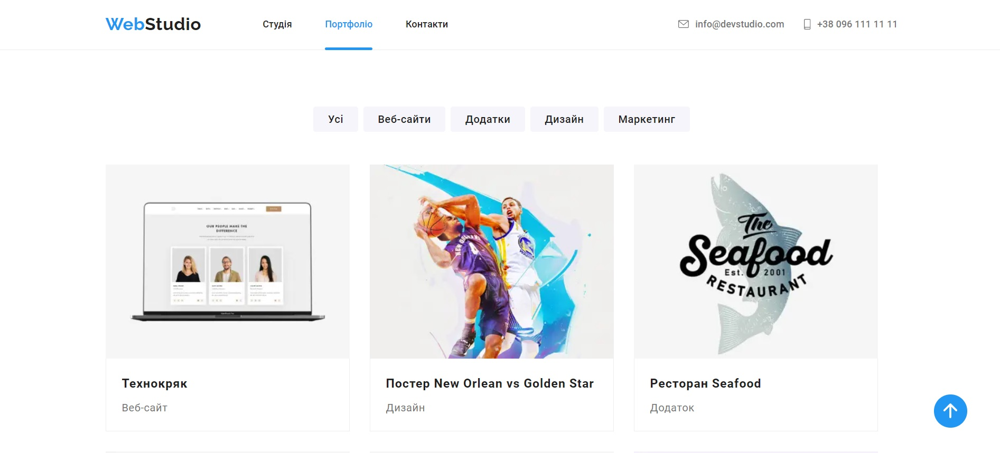
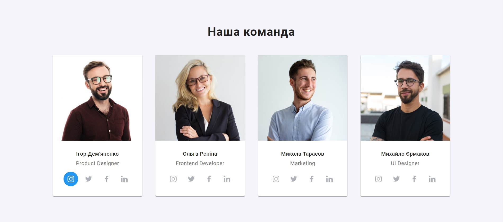
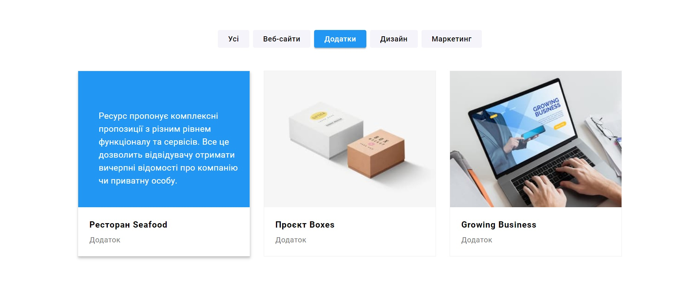

# WebStudio

Це README файл для веб-сайту-портфоліо WebStudio. Цей веб-сайт призначений для демонстрації робіт, навичок і послуг, що надаються WebStudio.

## Посилання

- **Сайт:** [https://www.webstudio.com](https://cupheadultra.github.io/webstudio/)

## Опис

Наша веб-студія спеціалізується на розробці веб-сайтів, веб-додатків і графічного дизайну. Ми працюємо з різними клієнтами, включаючи підприємства, стартапи та фізичних осіб. Наша мета - надавати високоякісні інтернет-рішення, які задовольняють потреби наших клієнтів.

- **Портфоліо**: На нашому сайті ви знайдете наші найкращі роботи і проекти. Ми пишемо короткий опис кожного проекту і надаємо зображення для візуального представлення.

- **Послуги**: Ми надаємо інформацію про послуги, які ми пропонуємо. Це включає веб-розробку, дизайн і інші послуги, що стосуються нашої спеціалізації.

- **Про нас**: Ви знайдете інформацію про нашу веб-студію, нашу команду і нашу місію.

## Функціональність сайту

- **Фільтрація** - на сторінці "Портфоліо" реалізована фільтрація за типами додатків.

## Використані технології

  &nbsp;
  &nbsp;
  &nbsp;
  &nbsp;

**Інструменти**:

    &nbsp;
  &nbsp;

## Про автора

Цей веб-сайт був створений Святославом Калугіном
[Github](https://https://github.com/CupheadUltra)
